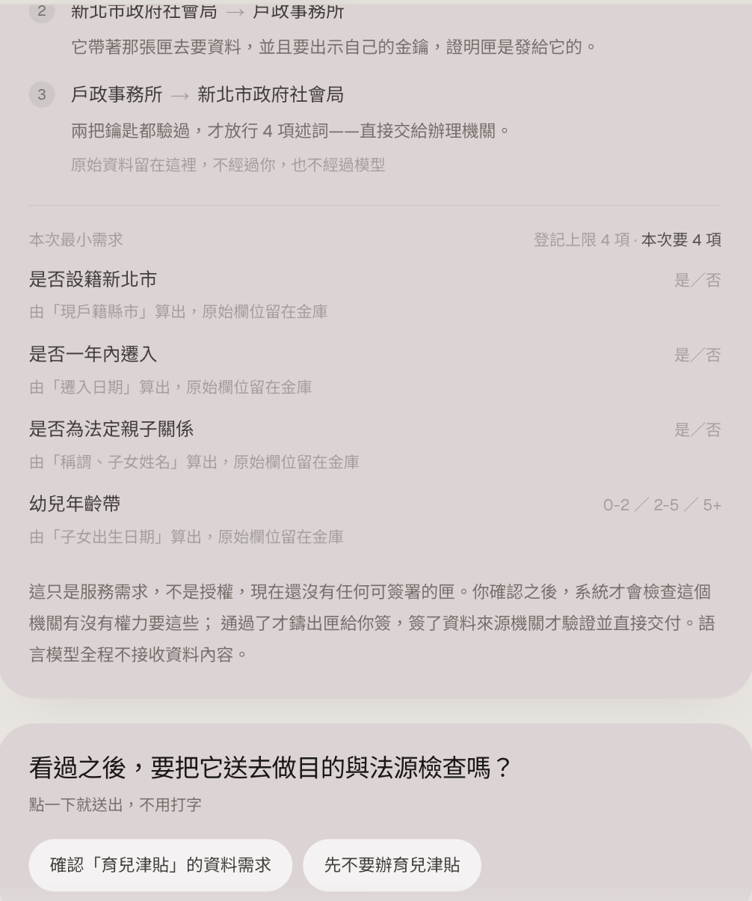

# GrantOnce 分匣授權

你搬了家，想辦育兒津貼。

社會局要確認四件事：你設籍新北市、一年內遷入、是孩子的法定家長、孩子在 0–2 歲。這四件事戶政事務所都知道。但社會局不能直接問戶政。沒有法定事由就不能調別人的資料，只能走公文。等公文的期間，津貼就卡著。

這種事到處都是。出生證明由診所開立、存在資料中心，要調出來得等三到五個工作天，而很多申辦都靠它證明親子關係。辦冷氣汰換補助，先在經濟部網站填一輪，還要台電三個月的電費紀錄，於是再跑一趟台電，最後卡在「我電號多少來著」。

技術上把這些串起來一點都不難。真正卡住的是法規。

## 法規怎麼說

> 公務機關對個人資料之蒐集或處理⋯⋯應有特定目的，並符合下列情形之一：一、執行法定職務必要範圍內。
>
> — [個人資料保護法 §15](https://law.moj.gov.tw/LawClass/LawAll.aspx?pcode=I0050021)

利用也一樣，§16 本文要求「於執行法定職務必要範圍內為之，並與蒐集之特定目的相符」；§5 再補一句，不得逾越特定目的之必要範圍。

所以每次調資料，都得有人回答「這個機關到底有沒有權力要這一筆」。走公文，是因為這個判斷過去只能靠承辦人一次一次做，做完也不會留下什麼可查的東西。

問題從來不在你有沒有證明文件。在於要資料的那一方，有沒有權力要。

## 做法

把那個判斷寫成程式在放行前一定會跑的檢查。

不是繞過法規。是把「這個機關有沒有權力要」從承辦人腦子裡的判斷，變成每次都跑、而且留下紀錄的一道關卡。

送過去的也不是你的資料，是答案。社會局要判斷四件事，它拿到的就是這四個答案：

| 機關要判斷的 | 傳統做法會拿到 | 這裡實際送出 |
| --- | --- | --- |
| 是否設籍新北市 | 戶籍謄本（含地址、戶號） | 是／否 |
| 是否一年內遷入 | 遷徙紀錄 | 是／否 |
| 是否為法定親子關係 | 戶籍謄本（含稱謂、子女姓名） | 是／否 |
| 幼兒年齡帶 | 出生日期 | 0-2／2-5／5+ |

姓名、地址、戶號、出生日期留在原地。健保卡號和所得永遠不會被授權。補助核定用不到（§5 必要範圍），而健保卡號還是串接就醫紀錄的鑰匙。

這四個答案有兩種送法：機關對機關直接送，或者做成卡片放進你自己的皮夾、之後由你出示。下面先講第一種。

每次辦一件事簽一張授權：只涵蓋這一次，只有指定的機關能用，幾分鐘後失效。一件事一張，分開裝，名字就是這麼來的。

要放行得同時滿足兩件事：你簽過名，而且機關能證明這張授權是發給它的。少一個都不行。就算你簽了，超出法定職務範圍的請求照樣擋下來。

誰、什麼時候、依哪一條、拿了哪幾項，全部留紀錄。可以撤銷；已經送出去的收不回來，畫面上也是這樣寫。

這樣一來兩邊都少做一些事。申請人不用再自己跑一趟戶政、印一份謄本轉交，看得到誰在什麼時候要了什麼，不想給就停在那裡；第二次辦同一件事，機關手上還在效期內的不會再問一次。承辦人不必自己拿捏範圍，超出登記目的的請求在放行前就擋掉，事後查得到當時依的是哪一條。

機關還多一個少被提到的好處：拿不到用不上的資料，就不必保管它。少收一欄，少一分外洩風險和保存責任。

## 實際流程

```
你：要辦育兒津貼
     ↓
① 找到已登記的服務        只給名單，這時什麼都還沒建立
     ↓  你選一個
② 社會局說它這次要什麼     只是需求，還沒有東西可簽
     ↓  你同意
③ 檢查目的與法源           通過了才產生要你簽的授權
     ↓
④ 你用 Face ID 簽名
     ↓
⑤ 社會局帶著它去戶政，出示自己的金鑰
   戶政驗過兩把鑰匙，把四個「是／否」直接交給社會局
     ↓
⑥ 社會局辦理、回覆你
```

順序是刻意的：先問你要不要辦，才問這個機關有沒有權力要。在你按下同意之前，系統裡不存在任何可以簽的東西。



第二次辦同一件事，機關手上還在效期內的，不會再跟你要一次：

```
登記上限 4 項 · 已持有 1 項 · 本次要 3 項
```

頂上五頁，各站在一個角色的位置：

- 授權：上面這段對話
- 金庫：你有哪些原始資料，哪幾欄被用來算答案、哪幾欄從沒動過、哪幾欄永不授權
- 機關：社會局那一側的收件匣。有幾顆「試著越界」的按鈕，可以當場看它被擋，以及擋的理由
- 憑證：同一份答案做成卡片交給你的樣子
- 登記台：機關登記服務的地方

## 機關這邊要做什麼

要資料的那一方（例中的社會局）和持有資料的那一方（戶政事務所），要做的事不一樣。

要資料的機關把每個服務登記一次，「登記台」那頁就是做這件事的。登記表要填的是[個資法 §8 第 1 項](https://law.moj.gov.tw/LawClass/LawAll.aspx?pcode=I0050021)那六款：機關名稱、蒐集目的、資料類別、利用的期間與地區與對象與方式、當事人的權利、不提供會有什麼影響。再加上這個目的依的是哪一條，以及授權最長能開多久。

少填一項就登記不上去。這不是刁難，那六款本來就是法律要求你告知當事人的；寫進登記表，民眾的同意畫面上才有東西可顯示。還要用白話寫一句「為什麼這幾項就夠、為什麼不要更多」，那句話會原封不動出現在他眼前。

持有資料的機關把每項判斷做成一個能回答「是／否」或級距的介面。戶政不是交出一份謄本，而是回答「這個人設籍新北市嗎」。做過一次，任何登記過的服務都能問它，不必為每個補助各做一套。

兩邊的順序不能顛倒：登記表不讓你勾選還不存在的資料項。要一項新的，得先由持有那份資料的機關做出來。不然登記表就成了許願池，寫得出來卻沒人能回答。

## 數位憑證皮夾

第二種送法。同樣那四個答案做成一張卡片交給你，放在「憑證」那一頁。

用的格式是 [SD-JWT](https://www.rfc-editor.org/rfc/rfc9901.html)。它的好處是出示時由你決定給幾題：四個答案各自獨立，只給其中兩個，剩下兩個對方連摘要都還原不出來。

卡片也送進了[數位發展部的數位憑證皮夾沙盒](https://wallet.gov.tw/zh-tw)，發卡、QR code、撤銷三支都接上了，也真的在上面發過一張。實際打過之後有四件事跟文件寫的不一樣，包括認證標頭的名稱和 QR code 的取得方式，這些都寫成測試而不是註解。

預設是關的，關著不會發出任何網路請求。要打沙盒得在 `.env.local` 補 `TWDIW_ENABLED=true` 和一把 API key，沒補的話畫面上會寫停用中和缺哪一項。

這一層在授權那條路的旁邊，不在裡面。機關取資料走的還是原本那兩把鑰匙。

## 跑起來

```bash
npm install
npm run dev         # http://localhost:43127
npm run test:all
npm run test:mutate # 注入 71 個 bug，每個都必須被某個測試抓到
```

Node 20 以上。沒有資料庫。

用 `localhost`，不要用 `127.0.0.1`。passkey 不接受 IP 位址當來源。

理解「使用者想做什麼」那一層可以接語言模型（`.env.local` 裡的 `AGENT_MODEL_*`），不接就退回關鍵字比對。它只判斷你想做什麼，至於符不符合資格、要哪幾項資料，一律由規則引擎和登記表決定。

外部 AI 助理可以透過 MCP 接進來（`npm run mcp`），查服務、代你向機關提出申請、追蹤進度、讀稽核紀錄。有兩件事它做不到，因為根本沒有那個工具：替你簽名，和替你同意機關的索取。

## 沒做到的部分

授權檢查、簽章驗證、一次性與效期、越權攔截、稽核軌跡、撤銷、資料最小化，這些是真的，有測試，也有 71 個注入的 bug 在確認那些測試守得住。SD-JWT 那層是照 RFC 9901 做的，測試餵的是規格附錄自己的向量，不是自己跟自己往返。

以下是演的：

- 所有機關跑在同一個程式裡，沒有跨過真實的機關邊界
- 沒有串 [MyData](https://mydata.nat.gov.tw)，金庫裡的資料是合成的
- 沒有做身分核驗。金鑰是自己註冊的，只證明「跟註冊時同一把」，不證明你是誰。正式版得在註冊時接 [自然人憑證／TW FidO](https://fido.moi.gov.tw/pt/)
- 資格規則寫死在程式裡。登記台掛新目的是真的，但誰符合它還得另外寫
- 案件進度是手動切換的，沒有接真實機關系統

簽名的法律定位也講清楚：passkey 簽章屬於[電子簽章法](https://law.moj.gov.tw/LawClass/LawAll.aspx?pcode=J0080037) §2 的電子簽章，有 §4 的效力，不會因為是電子形式就被否認。但它拿不到 §6 的「推定為本人親自簽名」，那要用主管機關許可的憑證機構所簽發的憑證。

§11 寫得很清楚：行政機關不能逕行排除電子簽章，只能公告技術與程序要求。去紙本的法律基礎本來就在，缺的是讓機關敢放手的控制手段。

法條都對過[全國法規資料庫](https://law.moj.gov.tw/LawClass/LawAll.aspx?pcode=I0050021)原文，查不到明確授權的就不引。
